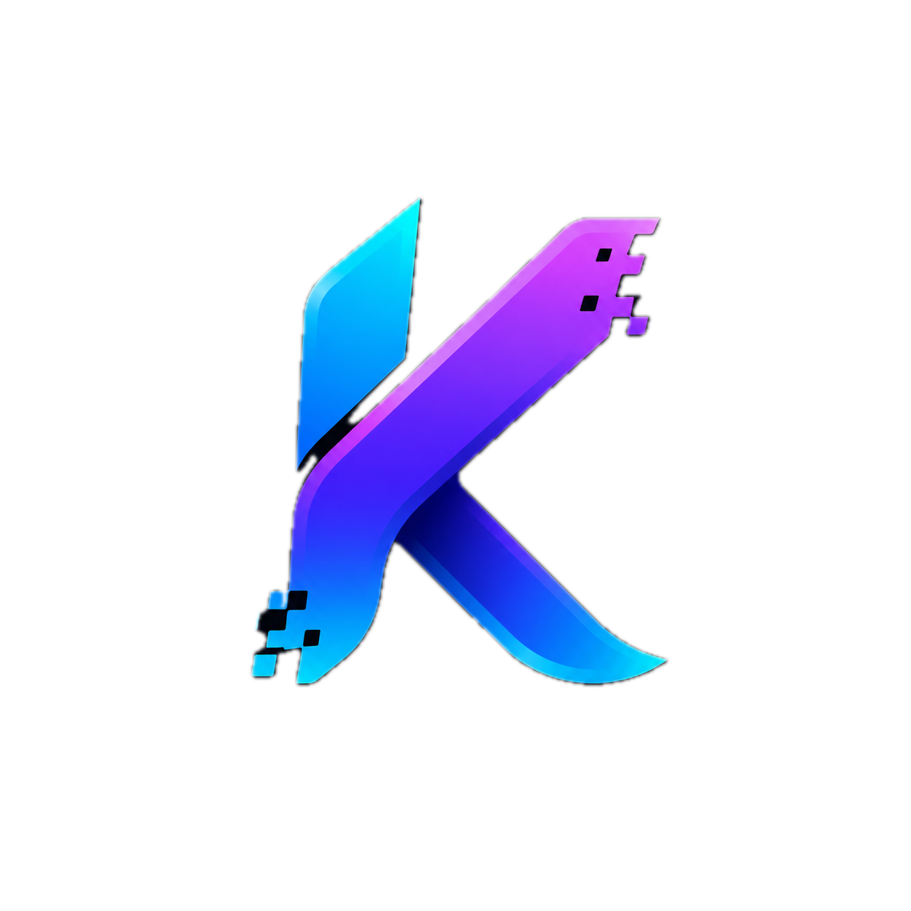

# Kinesis Showcase (by Blockcelerate)

Marketing and documentation site for the Kinesis SDK.



This app is a Vite + React + Tailwind v4 frontend in the monorepo, intended to showcase:
- Product positioning and features
- Live XRPL demo flow
- Code examples
- Full docs experience

## Stack

- React 19
- Vite 7
- Tailwind CSS v4
- TanStack Query
- Wouter routing

## Location

- Package: `artifacts/showcase`
- Workspace name: `@workspace/showcase`

## Prerequisites

- Node.js `24` (recommended for this workspace)
- `pnpm` 10+

## Install (workspace root)

```bash
pnpm install
```

## Run locally

The Vite config requires both `PORT` and `BASE_PATH`.

```bash
PORT=5173 BASE_PATH=/ pnpm --filter @workspace/showcase run dev
```

Then open:
- `http://localhost:5173/` (landing page)
- `http://localhost:5173/docs` (documentation page)

## Build

```bash
PORT=5173 BASE_PATH=/ pnpm --filter @workspace/showcase run build
```

## Preview build

```bash
PORT=5173 BASE_PATH=/ pnpm --filter @workspace/showcase run serve
```

## Key files

- `src/components/layout/Navbar.tsx` - top navigation and branding
- `src/components/layout/Footer.tsx` - footer branding and links
- `src/components/sections/*` - landing page sections
- `src/pages/home.tsx` - homepage composition
- `src/pages/docs.tsx` - docs page composition
- `src/index.css` - design tokens/theme
- `vite.config.ts` - runtime config (`PORT`, `BASE_PATH`)

## Brand Notes

- Primary public product name: `Kinesis SDK`
- Attribution: `by Blockcelerate`
- Contact: `info@blockcelerate.net`

When updating copy, keep the product name and attribution together in primary brand surfaces.
